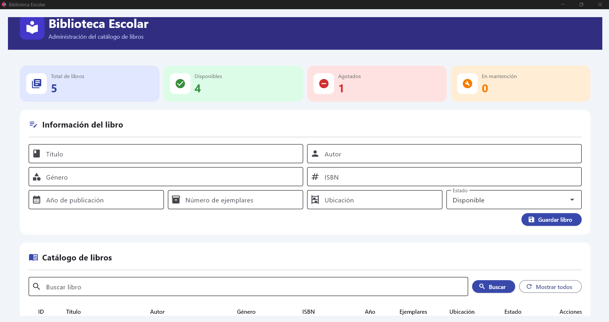
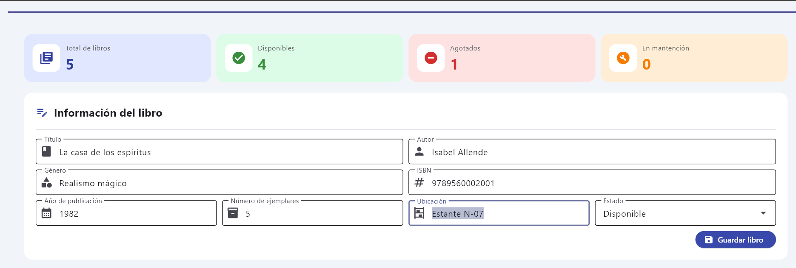
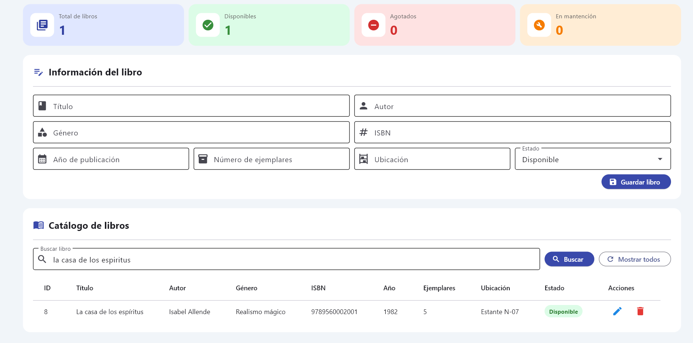
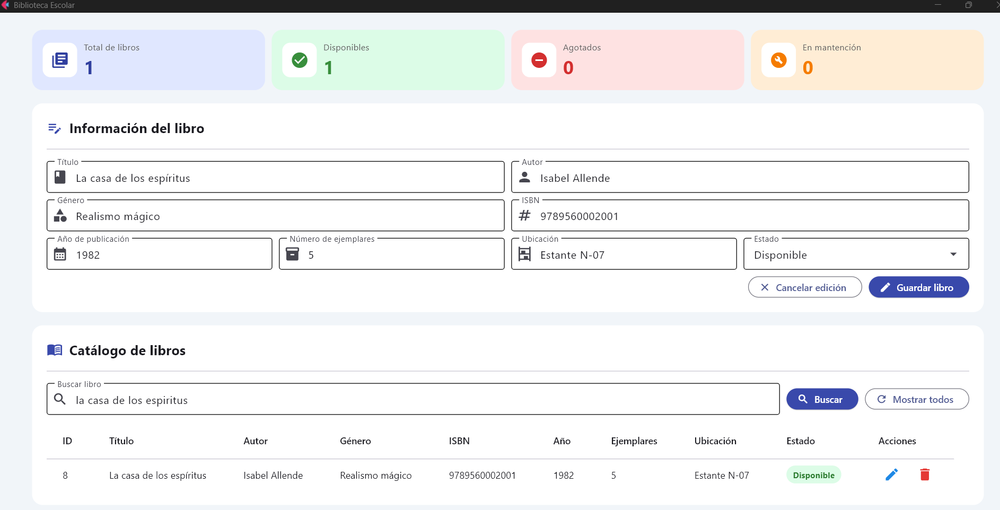
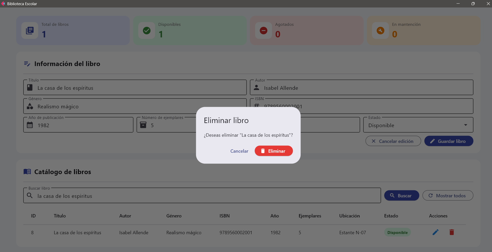
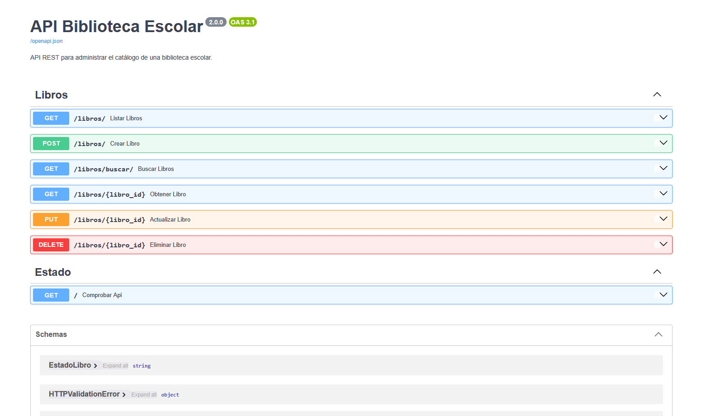

<div align="center">

# 📚 Biblioteca Escolar

### Sistema de administración de libros con FastAPI, Flet y MySQL


</div>

---

## 1. Descripción

Biblioteca Escolar es una aplicación de escritorio desarrollada en Python para administrar un catálogo de libros físicos.

El sistema utiliza:

- **Flet** para la interfaz gráfica.
- **FastAPI** para crear la API REST.
- **Pydantic** para validar los datos.
- **PyMySQL** para conectarse con MySQL.
- **MySQL** para almacenar la información.
- **DBeaver** para administrar la base de datos.
- **Git y GitHub** para controlar las versiones del proyecto.
- **PyCharm** como entorno de desarrollo.

Este proyecto permite comprender el funcionamiento de una aplicación dividida en frontend, backend y base de datos.

---

## 2. Funcionalidades

El sistema permite:

- Registrar libros.
- Mostrar todos los libros.
- Buscar por título, autor, género o ISBN.
- Obtener un libro mediante su ID.
- Editar uno o más datos de un libro.
- Eliminar libros con confirmación.
- Validar campos obligatorios.
- Validar números y rangos.
- Evitar ISBN repetidos.
- Registrar la ubicación física.
- Controlar la cantidad de ejemplares.
- Administrar el estado del libro.
- Mostrar mensajes de éxito y error.
- Mostrar indicadores del catálogo.
- Ejecutar triggers automáticamente en MySQL.
- Guardar fechas de creación y actualización.

---

## 3. Capturas del sistema

### Pantalla principal

La pantalla principal reúne los indicadores, el formulario de registro, el buscador y el catálogo de libros.



### Operaciones principales

| Registro de libros | Búsqueda de libros |
|---|---|
|  |  |

| Edición de un libro | Confirmación de eliminación |
|---|---|
|  |  |

### Documentación de la API

FastAPI genera automáticamente una interfaz de documentación interactiva mediante Swagger.



---

## 4. Arquitectura del sistema

```text
┌──────────────────────┐
│    Frontend Flet     │
│   Interfaz gráfica   │
└──────────┬───────────┘
           │ Peticiones HTTP
           │ GET, POST, PUT, DELETE
           ▼
┌──────────────────────┐
│   Backend FastAPI    │
│ Validación Pydantic  │
└──────────┬───────────┘
           │ Consultas SQL
           ▼
┌──────────────────────┐
│     Base MySQL       │
│  Tablas y triggers   │
└──────────────────────┘
```

### Recorrido de los datos

```text
Usuario
   ↓
Flet
   ↓
FastAPI
   ↓
Pydantic
   ↓
PyMySQL
   ↓
MySQL
```

El resultado regresa como JSON:

```text
MySQL → FastAPI → JSON → Flet → Usuario
```

---

## 5. Tecnologías utilizadas

| Tecnología | Función |
|---|---|
| Python | Lenguaje principal |
| FastAPI | Desarrollo del backend |
| Uvicorn | Servidor de la API |
| Pydantic | Validación de datos |
| Flet | Interfaz gráfica |
| Requests | Peticiones HTTP desde Flet |
| PyMySQL | Conexión con MySQL |
| MySQL | Base de datos |
| DBeaver | Administración de la base de datos |
| python-dotenv | Lectura del archivo `.env` |
| PyCharm | Entorno de programación |
| Git | Control de versiones |
| GitHub | Repositorio remoto |

---

## 6. Estructura del proyecto

```text
biblioteca-libros-inicial/
│
├── backend/
│   ├── __init__.py
│   ├── config.py
│   ├── database.py
│   ├── main.py
│   ├── schema.py
│   │
│   └── routes/
│       ├── __init__.py
│       └── libros.py
│
├── frontend/
│   ├── __init__.py
│   └── app.py
│
├── database/
│   ├── schema.sql
│   ├── seed.sql
│   └── triggers.sql
│
├── docs/
│   └── images/
│       ├── pantalla-principal.png
│       ├── registro-libro.png
│       ├── busqueda-libros.png
│       ├── edicion-libro.png
│       ├── eliminacion-libro.png
│       └── swagger-api.png
│
├── .env.example
├── .gitignore
├── requirements.txt
└── README.md
```

---

## 7. Explicación de los archivos

### Backend

| Archivo | Función |
|---|---|
| `backend/config.py` | Lee la configuración desde `.env` |
| `backend/database.py` | Abre conexiones con MySQL |
| `backend/schema.py` | Valida los datos con Pydantic |
| `backend/main.py` | Inicia FastAPI y registra las rutas |
| `backend/routes/libros.py` | Contiene el CRUD y la búsqueda |

### Frontend

| Archivo | Función |
|---|---|
| `frontend/app.py` | Contiene la interfaz completa de Flet |

### Base de datos

| Archivo | Función |
|---|---|
| `database/schema.sql` | Crea la base de datos y la tabla |
| `database/seed.sql` | Inserta libros iniciales |
| `database/triggers.sql` | Crea los triggers automáticos |

### Documentación visual

| Carpeta | Función |
|---|---|
| `docs/images/` | Almacena las capturas del producto final utilizadas en el README |

### Configuración

| Archivo | Función |
|---|---|
| `.env` | Guarda la configuración privada local |
| `.env.example` | Muestra un ejemplo sin contraseña real |
| `.gitignore` | Evita subir archivos privados o generados |
| `requirements.txt` | Contiene las dependencias |
| `README.md` | Documenta el proyecto |

---

## 8. Estructura de la tabla `libros`

| Campo | Tipo | Descripción |
|---|---|---|
| `id` | `INT` | Identificador autoincremental |
| `titulo` | `VARCHAR(150)` | Título del libro |
| `autor` | `VARCHAR(120)` | Autor |
| `genero` | `VARCHAR(60)` | Género literario |
| `isbn` | `VARCHAR(20)` | ISBN único y opcional |
| `anio_publicacion` | `SMALLINT` | Año de publicación |
| `ejemplares` | `SMALLINT` | Cantidad de ejemplares |
| `ubicacion` | `VARCHAR(50)` | Ubicación física |
| `estado` | `ENUM` | Estado actual |
| `fecha_creacion` | `TIMESTAMP` | Fecha de registro |
| `fecha_actualizacion` | `TIMESTAMP` | Última modificación |

---

## 9. Estados permitidos

| Estado | Significado |
|---|---|
| `DISPONIBLE` | Existen ejemplares utilizables |
| `AGOTADO` | No quedan ejemplares |
| `MANTENCION` | No puede utilizarse temporalmente |

Los triggers sincronizan automáticamente el estado:

- Si `ejemplares` es `0`, el estado será `AGOTADO`.
- Si `ejemplares` es mayor que `0`, será `DISPONIBLE`.
- Si se selecciona `MANTENCION`, se conserva ese estado.

---

## 10. Requisitos previos

Antes de ejecutar el proyecto se necesita:

- Windows 10 u 11.
- Python 3.11 o superior.
- MySQL Server 8.0 o superior.
- DBeaver.
- Git.
- PyCharm.
- Una cuenta de GitHub.

Comprobar Python:

```powershell
python --version
```

Comprobar Git:

```powershell
git --version
```

---

## 11. Descargar el proyecto

### Desde PyCharm

1. Abrir PyCharm.
2. Seleccionar **Get from VCS**.
3. Pegar:

```text
https://github.com/nassjin/biblioteca-libros-inicial.git
```

4. Seleccionar la carpeta de destino.
5. Presionar **Clone**.
6. Seleccionar **Trust Project**.

### Desde PowerShell

```powershell
git clone https://github.com/nassjin/biblioteca-libros-inicial.git
cd biblioteca-libros-inicial
```

---

## 12. Crear el entorno virtual

Desde la carpeta principal:

```powershell
python -m venv .venv
```

Activar:

```powershell
.\.venv\Scripts\Activate.ps1
```

Si PowerShell bloquea la activación:

```powershell
Set-ExecutionPolicy -Scope Process -ExecutionPolicy Bypass
```

Después:

```powershell
.\.venv\Scripts\Activate.ps1
```

La terminal debería mostrar:

```text
(.venv) PS C:\...\biblioteca-libros-inicial>
```

---

## 13. Configurar el intérprete en PyCharm

Abrir:

```text
File
→ Settings
→ Project
→ Python Interpreter
→ Add Interpreter
→ Add Local Interpreter
→ Existing
```

Seleccionar:

```text
.venv\Scripts\python.exe
```

Comprobar el intérprete:

```powershell
python -c "import sys; print(sys.executable)"
```

La ruta debe terminar en:

```text
.venv\Scripts\python.exe
```

---

## 14. Instalar dependencias

Actualizar `pip`:

```powershell
python -m pip install --upgrade pip
```

Instalar el proyecto:

```powershell
python -m pip install -r requirements.txt
```

Comprobar Flet:

```powershell
python -c "import importlib.metadata; print(importlib.metadata.version('flet'))"
```

Versión utilizada:

```text
0.86.5
```

---

## 15. Configurar `.env`

Crear una copia de `.env.example`:

```powershell
Copy-Item .env.example .env
```

Abrir `.env` y completar:

```env
# Configuración de MySQL
DB_HOST=localhost
DB_PORT=3306
DB_USER=NOMBRE_USUSARIO
DB_PASSWORD=TU_CONTRASEÑA_REAL
DB_NAME=NOMBRE_BASE_DE_DATOS

# Configuración de FastAPI
API_HOST=127.0.0.1
API_PORT=8000

# Dirección utilizada por Flet
API_URL=http://127.0.0.1:8000
```

Si MySQL no tiene contraseña:

```env
DB_PASSWORD=
```

Comprobar que Git ignore `.env`:

```powershell
git check-ignore .env
```

Resultado esperado:

```text
.env
```

> Nunca se debe subir `.env` a GitHub.

---

## 16. Crear la base de datos

Abrir DBeaver y conectarse con MySQL.

Ejecutar los archivos en este orden:

```text
1. database/schema.sql
2. database/seed.sql
3. database/triggers.sql
```

### Comprobar la base de datos

```sql
SHOW DATABASES;
```

### Seleccionar la base

```sql
USE biblioteca_escolar;
```

### Comprobar la tabla

```sql
DESCRIBE libros;
```

### Mostrar los datos

```sql
SELECT *
FROM libros
ORDER BY titulo;
```

### Comprobar los triggers

```sql
SHOW TRIGGERS
FROM biblioteca_escolar;
```

Deben aparecer:

```text
trg_libros_before_insert
trg_libros_before_update
```

---

## 17. Ejecutar el backend

Abrir una terminal de PyCharm:

```powershell
python -m uvicorn backend.main:app --reload
```

Resultado esperado:

```text
Uvicorn running on http://127.0.0.1:8000
```

Abrir en el navegador:

```text
http://127.0.0.1:8000
```

Documentación Swagger:

```text
http://127.0.0.1:8000/docs
```

Para detener FastAPI:

```text
Ctrl + C
```

---

## 18. Ejecutar el frontend

Mantener FastAPI abierto y crear una segunda terminal en PyCharm.

Ejecutar:

```powershell
python -m frontend.app
```

El backend y el frontend deben permanecer abiertos al mismo tiempo:

```text
Terminal 1 → FastAPI
Terminal 2 → Flet
```

---

## 19. Endpoints de la API

| Método | Endpoint | Operación |
|---|---|---|
| `GET` | `/` | Comprobar el servidor |
| `GET` | `/libros/` | Mostrar todos los libros |
| `GET` | `/libros/buscar/` | Buscar por texto |
| `GET` | `/libros/{libro_id}` | Obtener por ID |
| `POST` | `/libros/` | Registrar un libro |
| `PUT` | `/libros/{libro_id}` | Actualizar |
| `DELETE` | `/libros/{libro_id}` | Eliminar |

---

## 20. Ejemplo para registrar un libro

```json
{
  "titulo": "El principito",
  "autor": "Antoine de Saint-Exupéry",
  "genero": "Narrativa",
  "isbn": "9780156012195",
  "anio_publicacion": 1943,
  "ejemplares": 4,
  "ubicacion": "Estante A-01",
  "estado": "DISPONIBLE"
}
```

---

## 21. Búsqueda de libros

Ejemplo:

```text
GET /libros/buscar/?texto=principito
```

La búsqueda revisa:

- Título.
- Autor.
- Género.
- ISBN.

---

## 22. Prueba completa del sistema

Se recomienda probar en este orden:

1. Iniciar MySQL.
2. Ejecutar FastAPI.
3. Abrir Swagger.
4. Probar `GET /libros/`.
5. Registrar un libro.
6. Abrir Flet.
7. Comprobar que aparezca el libro.
8. Buscarlo.
9. Editarlo.
10. Cancelar una edición.
11. Cambiar los ejemplares a cero.
12. Comprobar que el trigger lo marque como `AGOTADO`.
13. Eliminar el libro.
14. Comprobar los mensajes de éxito y error.

---

## 23. Códigos HTTP utilizados

| Código | Significado |
|---:|---|
| `200` | Operación correcta |
| `201` | Libro registrado |
| `204` | Libro eliminado |
| `400` | Datos incorrectos |
| `404` | Libro no encontrado |
| `409` | ISBN repetido |
| `422` | Error de validación |
| `500` | Error del servidor |

---

## 24. Errores frecuentes

### No se reconoce Python

```text
python no se reconoce como un comando
```

Solución:

- Instalar Python.
- Marcar **Add Python to PATH**.
- Reiniciar PyCharm.

### No se puede activar `.venv`

```powershell
Set-ExecutionPolicy -Scope Process -ExecutionPolicy Bypass
.\.venv\Scripts\Activate.ps1
```

### No existe el módulo `backend`

Ejecutar desde la raíz:

```powershell
cd C:\ruta\biblioteca-libros-inicial
python -m uvicorn backend.main:app --reload
```

### No se puede conectar con FastAPI

Comprobar que esté ejecutándose:

```powershell
python -m uvicorn backend.main:app --reload
```

Comprobar:

```text
http://127.0.0.1:8000/docs
```

### Error 1045 de MySQL

```text
Access denied for user
```

Revisar en `.env`:

```env
DB_USER=NOMBRE_USUARIO
DB_PASSWORD=TU_CONTRASEÑA
```

### Error 1049 de MySQL

```text
Unknown database
```

Ejecutar:

```text
database/schema.sql
```

### ISBN repetido

Cada ISBN debe ser único. Puede dejarse vacío si el libro no dispone de uno.

### `Page` no tiene el método `open`

Este proyecto utiliza Flet 0.86.5.

La forma correcta es:

```python
page.show_dialog(mensaje)
```

Para cerrar un diálogo:

```python
page.pop_dialog()
```

---

## 25. Flujo básico de Git

Comprobar los cambios:

```powershell
git status
```

Revisar el contenido modificado:

```powershell
git diff
```

Preparar los archivos:

```powershell
git add .
```

Revisar lo preparado:

```powershell
git status
```

Crear el commit:

```powershell
git commit -m "feat: describir el cambio realizado"
```

Subir a GitHub:

```powershell
git push
```

---

## 26. Trabajar con ramas

Ver las ramas:

```powershell
git branch
```

Crear una rama:

```powershell
git switch -c nombre-apellido
```

Publicarla:

```powershell
git push -u origin nombre-apellido
```

Cambiar a una rama:

```powershell
git switch nombre-rama
```

Actualizar la rama principal:

```powershell
git switch main
git pull origin main
```

Actualizar una rama de trabajo con `main`:

```powershell
git switch nombre-rama
git merge main
```

Subir cambios:

```powershell
git push
```

---

## 27. Convención de commits

| Prefijo | Uso |
|---|---|
| `feat` | Agregar una funcionalidad |
| `fix` | Corregir un error |
| `style` | Mejorar el diseño |
| `refactor` | Reorganizar el código |
| `docs` | Actualizar documentación |
| `test` | Agregar pruebas |
| `chore` | Configuración o mantenimiento |

Ejemplos:

```powershell
git commit -m "feat: agregar búsqueda de libros"
git commit -m "fix: corregir conexión con MySQL"
git commit -m "style: mejorar interfaz Flet"
git commit -m "refactor: ordenar rutas del backend"
git commit -m "docs: actualizar instrucciones de PyCharm"
```

---

## 28. Buenas prácticas de GitHub

Antes de cada commit:

```powershell
git status
git diff
```

Después:

```powershell
git add .
git status
git commit -m "mensaje claro"
git push
```

No subir:

- `.env`
- `.venv`
- `venv`
- `.idea`
- `__pycache__`
- Contraseñas.
- Archivos temporales.

---

## 29. Integrar una rama con `main`

Primero confirmar que la rama de trabajo esté guardada:

```powershell
git status
git push
```

Cambiar a `main`:

```powershell
git switch main
```

Actualizar:

```powershell
git pull origin main
```

Fusionar la rama:

```powershell
git merge reconstruccion-pycharm
```

Subir el resultado:

```powershell
git push origin main
```

Comprobar:

```powershell
git log --oneline --graph --all
```

No eliminar la rama hasta comprobar que el proyecto funcione correctamente en `main`.

---

## 30. Seguridad

El proyecto aplica las siguientes medidas:

- Variables privadas en `.env`.
- `.env` excluido de Git.
- Consultas SQL parametrizadas.
- Validación mediante Pydantic.
- Restricciones en MySQL.
- ISBN único.
- Confirmación antes de eliminar.
- `rollback` cuando falla una operación.
- Cierre de conexiones con MySQL.

---

## 31. Posibles mejoras futuras

- Crear una tabla de autores.
- Crear una tabla de préstamos.
- Registrar estudiantes.
- Controlar devoluciones.
- Agregar portadas de libros.
- Incorporar paginación.
- Exportar el catálogo a Excel o PDF.
- Agregar autenticación.
- Crear roles de administrador.
- Registrar un historial de cambios.
- Crear copias de seguridad.

---

## 32. Objetivo educativo

Este proyecto permite practicar:

- Organización de un proyecto Python.
- Programación con funciones.
- Interfaz gráfica con Flet.
- API REST con FastAPI.
- Validación con Pydantic.
- CRUD completo.
- Consultas SQL.
- Conexión con MySQL.
- Triggers.
- Variables de entorno.
- Manejo de errores.
- Git y GitHub.

---

## 33. Autor

Proyecto educativo desarrollado por **Nicolás** para el aprendizaje de programación, bases de datos, interfaces gráficas y control de versiones.

---

<div align="center">

### 📘 Biblioteca Escolar

Proyecto educativo con Python, FastAPI, Flet y MySQL.

</div>
